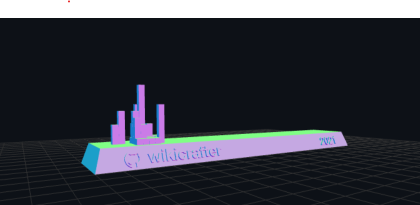

 

* 😎 I'm Giga you can call me Charly (he/him or they/them)

I'm looking for a mentor  

Be  ✨ _Altruistic_ ✨

<!--
-->
  

If you want to support me, maybe you consider buying me a coffee 
  

  Or here is my Eth. address:   0xb876CD01F966cA4d0E340f80E46Fa65CBa39B401

<!-- 💻📱📍🗺 I'm available for freelance jobs as a python programmer
- 🔭 I’m currently working on Python
- 🌱 I’m currently learning Ruby
- 💡 Feel free to give me advice, tips, and tricks
-->
- 💡 I’m currently looking investors for startup
- 👯 I’m looking to collaborate on any useful opensource project
- 🤔 Should I learn Dart PL?
- 💡  Feel free to give me advice, tips, and tricks

  

  

    
  

  

  
<!--
 - 📫 How to reach me: text me on <a href="https://twitter.com/-------">Twitter 
</a>

#### If you want to support me with digital currency here is my binance QR:

 -->

  
<!--  -->

<!--

  

- 🔭 I’m currently working on ...
- 🌱 I’m currently learning ...
- 👯 I’m looking to collaborate on ...
- 🤔 I’m looking for help with ...
- 💬 Ask me about ...
- 📫 How to reach me: ...
- 😄 Pronouns: ...
- ⚡ Fun fact: ...
-->
